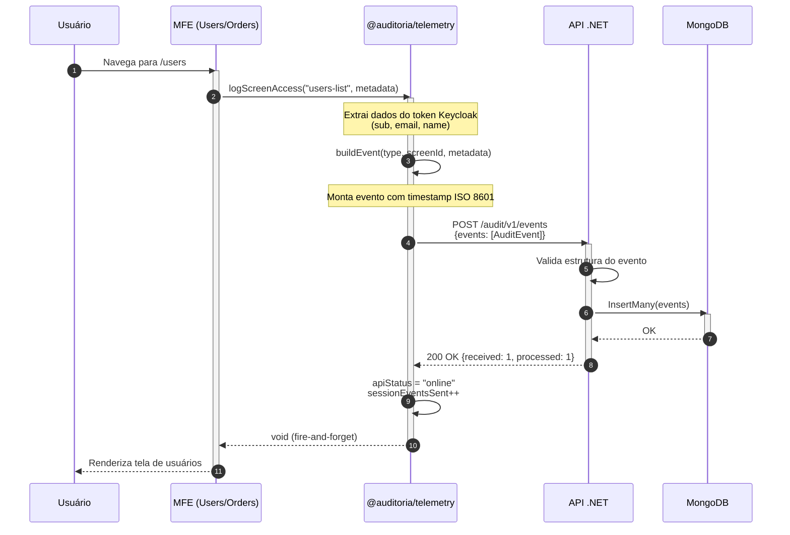
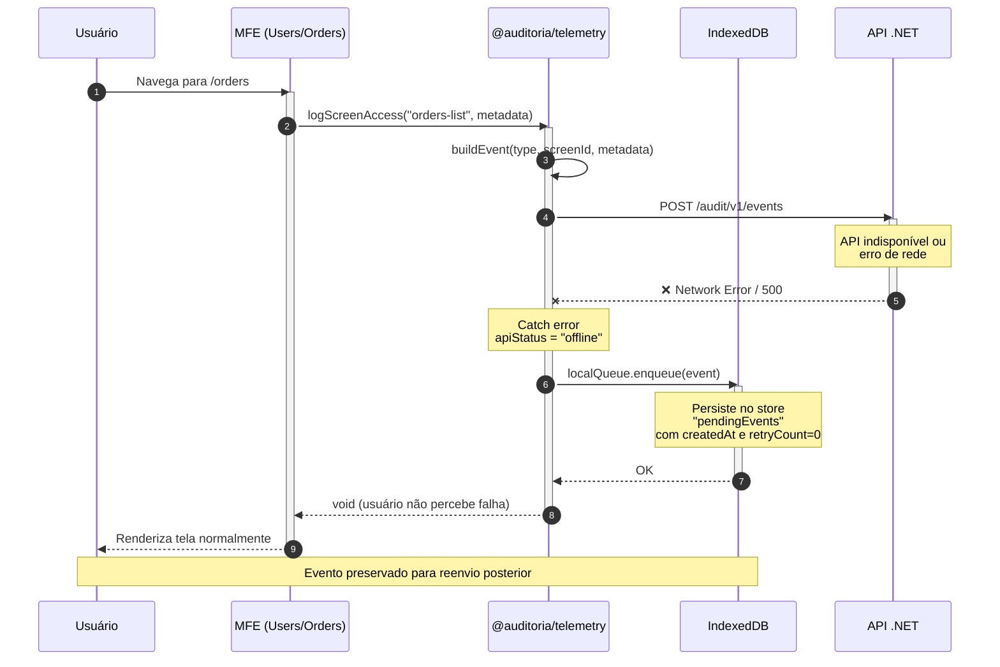
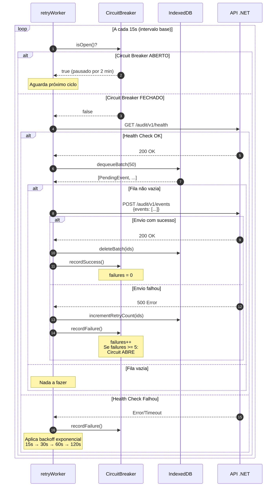
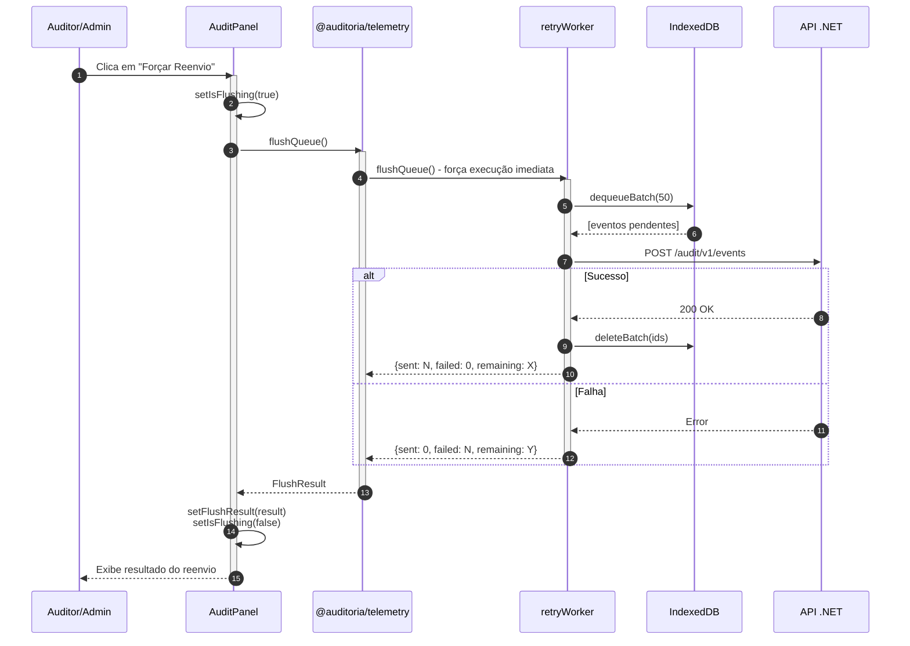
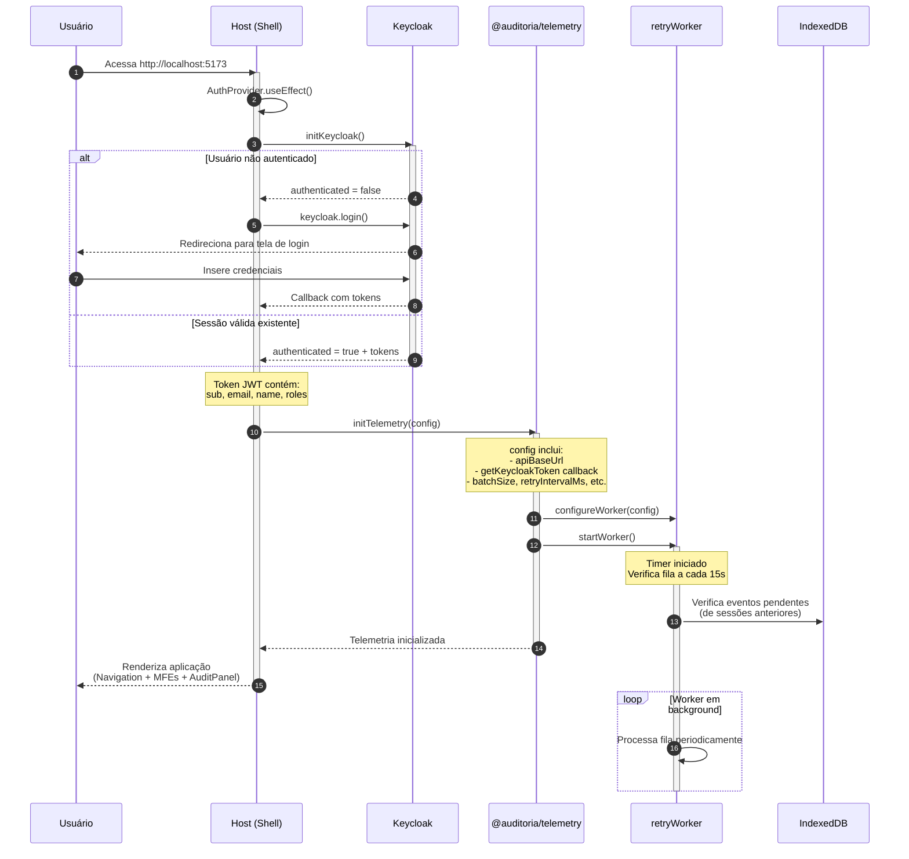
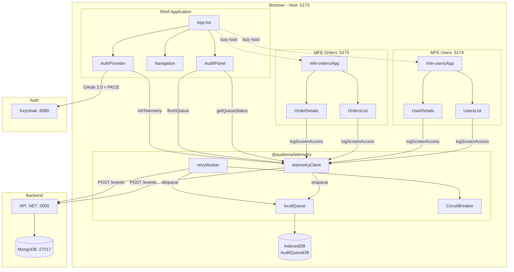
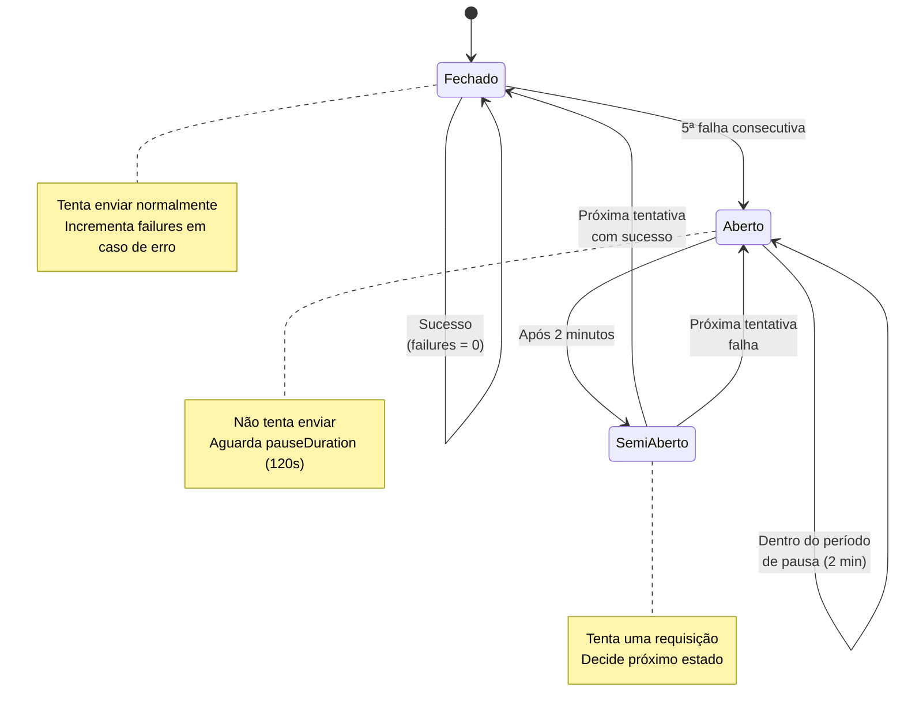
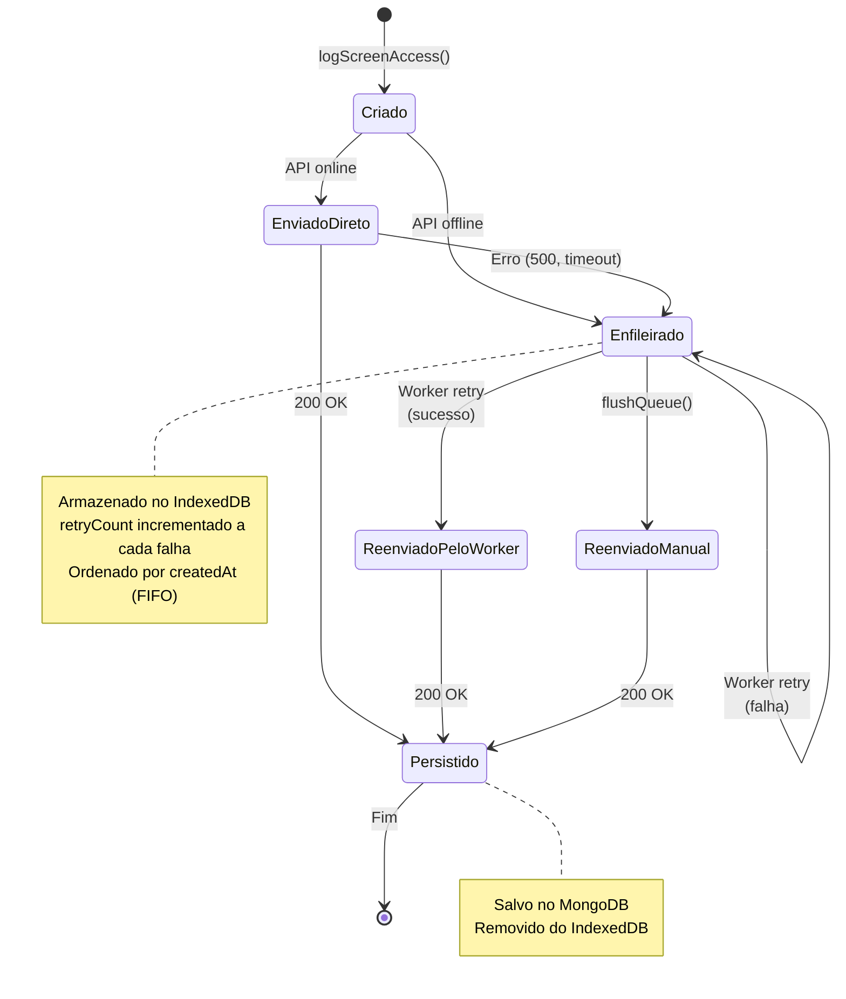

# PRD: POC de Auditoria em Micro Frontends com Module Federation

## Visão Geral

Esta POC (Proof of Concept) visa validar uma arquitetura de auditoria de acesso a telas em aplicações Micro Frontend (MFE), utilizando Module Federation para compartilhamento de uma biblioteca de telemetria e uma API REST de auditoria em .NET com mecanismo de fallback resiliente (fila local + reenvio assíncrono).

**Problema a Resolver:**  
Organizações precisam auditar o acesso dos usuários às telas de sistemas distribuídos em MFEs de forma centralizada, confiável e sem perda de eventos, mesmo quando a API de auditoria estiver temporariamente indisponível.

**Proposta de Valor:**  
- Desacoplamento: MFEs não conhecem detalhes da API de auditoria
- Padronização: Todos os MFEs usam a mesma biblioteca compartilhada
- Resiliência: Eventos são preservados localmente e reenviados quando a API se recupera
- Rastreabilidade: Informações do usuário autenticado (Keycloak) são capturadas automaticamente

## Objetivos

| Objetivo | Métrica de Sucesso |
|----------|-------------------|
| Validar arquitetura Module Federation com biblioteca compartilhada | MFEs carregam e usam a biblioteca de telemetria sem duplicação de código |
| Garantir rastreabilidade de acessos | 100% dos acessos a telas geram eventos com `userId` extraído do token Keycloak |
| Validar resiliência com fila local | Eventos são preservados no IndexedDB quando API falha e reenviados após recuperação |
| Demonstrar integração com Keycloak | Autenticação funcional com 2-3 usuários de teste, dados do token presentes nos eventos |
| Visualizar status de auditoria | Painel no Host exibe eventos pendentes e status da API em tempo real |

## Histórias de Usuário

### Persona 1: Desenvolvedor de MFE
> Como desenvolvedor de um Micro Frontend, eu quero importar uma biblioteca de telemetria compartilhada e chamar funções simples para que os acessos às telas sejam auditados automaticamente, sem eu precisar conhecer os detalhes da API de auditoria.

### Persona 2: Usuário do Sistema
> Como usuário autenticado, eu quero que meus acessos às telas sejam registrados de forma transparente para que haja rastreabilidade das minhas ações no sistema.

### Persona 3: Auditor/Administrador
> Como auditor, eu quero visualizar um painel com o status dos eventos de auditoria (enviados/pendentes) para que eu possa monitorar a saúde do sistema de auditoria.

### Fluxos Principais

1. **Acesso a tela com API online**: Usuário navega → Evento enviado imediatamente → Confirmação de sucesso
2. **Acesso a tela com API offline**: Usuário navega → Tentativa falha → Evento salvo na fila local
3. **Reenvio automático**: Worker verifica fila → API recuperada → Eventos reenviados com sucesso
4. **Visualização de status**: Auditor acessa painel → Vê contagem de eventos pendentes e status da API

## Funcionalidades Principais

### RF01 - Biblioteca de Telemetria Compartilhada

**O que faz:** Módulo exposto via Module Federation que fornece funções para registro de eventos de auditoria.

**Por que é importante:** Centraliza a lógica de auditoria, evitando duplicação e garantindo padronização entre MFEs.

**Requisitos Funcionais:**
- RF01.1: Expor função `logScreenAccess(screenId: string, metadata?: object)` para registrar acesso a telas
- RF01.2: Expor função `logNavigation(from: string | null, to: string)` para registrar navegações
- RF01.3: Expor função `logApiIntent(endpoint: string, metadata?: object)` para registrar intenção de chamada API
- RF01.4: Expor função `logApiError(endpoint: string, error: unknown, metadata?: object)` para registrar erros de API
- RF01.5: Capturar automaticamente `userId`, `email` e `name` do token JWT do Keycloak
- RF01.6: Incluir `timestamp` ISO 8601 em todos os eventos
- RF01.7: Tentar envio imediato para API; em caso de falha, armazenar no IndexedDB
- RF01.8: Expor função `flushQueue()` para reenvio manual/programático de eventos pendentes

### RF02 - Fila Local com IndexedDB

**O que faz:** Armazena eventos de auditoria localmente quando a API está indisponível.

**Por que é importante:** Garante zero perda de eventos mesmo com instabilidade de rede ou API.

**Requisitos Funcionais:**
- RF02.1: Implementar operação `enqueue(event)` para salvar evento pendente
- RF02.2: Implementar operação `dequeueBatch(limit)` para ler lote de eventos para envio
- RF02.3: Implementar operação `deleteBatch(ids)` para remover eventos enviados com sucesso
- RF02.4: Implementar operação `count()` para retornar quantidade de eventos pendentes
- RF02.5: Persistir eventos entre reloads da página

### RF03 - Worker de Reenvio

**O que faz:** Processo em background que periodicamente tenta reenviar eventos pendentes.

**Por que é importante:** Automatiza a recuperação de eventos quando a API se torna disponível.

**Requisitos Funcionais:**
- RF03.1: Executar verificação de fila a cada 15 segundos
- RF03.2: Implementar backoff exponencial em caso de falhas consecutivas (15s → 30s → 60s → 120s)
- RF03.3: Implementar circuit breaker simples: após 5 falhas consecutivas, pausar por 2 minutos
- RF03.4: Processar eventos em lotes de até 50 itens por vez

### RF04 - Micro Frontend de Usuários (mfe-users)

**O que faz:** MFE de exemplo que demonstra integração com a biblioteca de telemetria.

**Requisitos Funcionais:**
- RF04.1: Implementar rota `/users` (listagem) com chamada `logScreenAccess("users-list")`
- RF04.2: Implementar rota `/users/:id` (detalhe) com chamada `logScreenAccess("users-details", { userId })`
- RF04.3: Exigir autenticação via Keycloak para acesso às rotas

### RF05 - Micro Frontend de Pedidos (mfe-orders)

**O que faz:** MFE de exemplo que demonstra integração com a biblioteca de telemetria.

**Requisitos Funcionais:**
- RF05.1: Implementar rota `/orders` (listagem) com chamada `logScreenAccess("orders-list")`
- RF05.2: Implementar rota `/orders/:id` (detalhe) com chamada `logScreenAccess("orders-details", { orderId })`
- RF05.3: Exigir autenticação via Keycloak para acesso às rotas

### RF06 - Host (Shell)

**O que faz:** Aplicação principal que orquestra os MFEs e exibe o painel de auditoria.

**Requisitos Funcionais:**
- RF06.1: Carregar mfe-users e mfe-orders via Module Federation
- RF06.2: Carregar biblioteca de telemetria como módulo compartilhado
- RF06.3: Exibir menu de navegação para os MFEs
- RF06.4: Integrar com Keycloak para autenticação centralizada
- RF06.5: Redirecionar usuários não autenticados para login do Keycloak

### RF07 - Painel de Auditoria

**O que faz:** Interface visual para monitoramento do status de auditoria.

**Requisitos Funcionais:**
- RF07.1: Exibir contador de eventos pendentes na fila local
- RF07.2: Exibir status da API de auditoria (Online/Offline)
- RF07.3: Exibir contador de eventos enviados com sucesso na sessão atual
- RF07.4: Atualizar informações automaticamente a cada 5 segundos
- RF07.5: Botão para forçar reenvio manual (`flushQueue`)

### RF08 - API REST de Auditoria (.NET)

**O que faz:** Backend que recebe e persiste eventos de auditoria em MongoDB.

**Requisitos Funcionais:**
- RF08.1: Implementar endpoint `POST /audit/v1/events` que recebe array de eventos
- RF08.2: Implementar endpoint `GET /audit/v1/health` que retorna status da API
- RF08.3: Persistir eventos recebidos no MongoDB
- RF08.4: Simular instabilidade: ~30% das requisições retornam erro 500 (configurável via variável de ambiente)
- RF08.5: Validar estrutura do evento (type, screenId, timestamp, userId são obrigatórios)
- RF08.6: Retornar 200 OK para eventos válidos, 400 Bad Request para inválidos
- RF08.7: Implementar endpoint `GET /audit/v1/events` para consulta de eventos (paginado)
- RF08.8: Garantir SLA de 99% de disponibilidade

### RF09 - Integração com Keycloak

**O que faz:** Provê autenticação e autorização para os MFEs.

**Requisitos Funcionais:**
- RF09.1: Configurar realm "auditoria-poc" no Keycloak
- RF09.2: Criar client "mfe-host" com fluxo Authorization Code + PKCE
- RF09.3: Criar 2-3 usuários de teste com diferentes perfis
- RF09.4: Token JWT deve conter claims: sub (userId), email, preferred_username, name
- RF09.5: Biblioteca de telemetria deve extrair dados do token decodificado (sem validação de assinatura no frontend)

## Experiência do Usuário

### Fluxo Principal de Navegação

1. Usuário acessa a aplicação Host
2. Se não autenticado, é redirecionado para tela de login do Keycloak
3. Após autenticação, retorna ao Host com token JWT
4. Usuário navega pelos MFEs (Users, Orders)
5. Cada acesso a tela dispara evento de auditoria automaticamente
6. Painel de status (canto inferior ou barra lateral) mostra contagem de eventos

### Interface do Painel de Auditoria

```
┌─────────────────────────────────────┐
│  📊 Status de Auditoria            │
├─────────────────────────────────────┤
│  API: 🟢 Online                     │
│  Eventos enviados: 15               │
│  Eventos pendentes: 0               │
│                                     │
│  [🔄 Forçar Reenvio]                │
└─────────────────────────────────────┘
```

### Considerações de UI/UX

- Design simples e funcional (sem design system específico)
- Painel de auditoria não deve obstruir a navegação principal
- Feedback visual quando evento é enfileirado (ícone de status muda)
- Cores semânticas: verde (online/sucesso), amarelo (pendente), vermelho (offline/erro)

## Restrições Técnicas de Alto Nível

| Categoria | Restrição |
|-----------|-----------|
| Frontend Framework | React 18+ com Vite |
| Module Federation | @originjs/vite-plugin-federation |
| Backend | .NET 8 (ASP.NET Core Minimal API) |
| Banco de Dados | MongoDB 7+ em container Docker |
| Autenticação | Keycloak 24+ em container Docker |
| Armazenamento Local | IndexedDB (via idb ou Dexie.js) |
| Protocolo | HTTPS em produção; HTTP permitido em desenvolvimento local |
| Browser Support | Navegadores modernos com suporte a IndexedDB e ES2020+ |
| SLA | 99% de disponibilidade da API de auditoria |

### Integrações

- **Keycloak**: OAuth 2.0 / OpenID Connect com fluxo Authorization Code + PKCE
- **API de Auditoria**: REST sobre HTTP/HTTPS

### Segurança

- Tokens JWT devem ter expiração curta (5-15 minutos) com refresh token
- API de auditoria deve validar origem das requisições (CORS)
- Dados sensíveis não devem ser incluídos nos eventos de auditoria

## Não-Objetivos (Fora de Escopo)

| Item | Justificativa |
|------|---------------|
| Funcionamento offline completo (Service Worker) | POC foca em resiliência com API instável, não offline-first |
| Limite de tamanho da fila IndexedDB | Será endereçado em versão futura |
| Descarte automático de eventos antigos | Será endereçado em versão futura |
| Dashboard analítico de auditoria | Fora do escopo da POC |
| Testes automatizados E2E | Nice-to-have, não obrigatório para POC |
| CI/CD | Fora do escopo da POC |
| Múltiplos realms/tenants no Keycloak | POC usa realm único |
| Suporte a múltiplos idiomas (i18n) | Não necessário para POC |
| Auditoria de ações além de acesso a telas | Escopo limitado a navegação entre telas |

## Estrutura de Evento de Auditoria

```json
{
  "type": "SCREEN_ACCESS",
  "screenId": "users-list",
  "timestamp": "2026-01-28T22:15:00.000Z",
  "userId": "550e8400-e29b-41d4-a716-446655440000",
  "userEmail": "joao.silva@example.com",
  "userName": "João Silva",
  "metadata": {
    "sourceMfe": "mfe-users",
    "path": "/users",
    "sessionId": "abc123"
  }
}
```

### Tipos de Evento Suportados

| Tipo | Descrição |
|------|-----------|
| `SCREEN_ACCESS` | Acesso a uma tela/rota |
| `NAVIGATION` | Navegação entre telas |
| `API_INTENT` | Intenção de chamada a API |
| `API_ERROR` | Erro em chamada de API |

---

## Arquitetura da Solução

### Visão Geral dos Componentes

A arquitetura segue o padrão **Module Federation** do Webpack/Vite, permitindo que múltiplos Micro Frontends compartilhem uma biblioteca de telemetria única, evitando duplicação de código e garantindo consistência no registro de eventos.

```
┌─────────────────────────────────────────────────────────────────────────────┐
│                              NAVEGADOR                                      │
├─────────────────────────────────────────────────────────────────────────────┤
│  ┌─────────────────────────────────────────────────────────────────────┐    │
│  │                         HOST (Shell) :5173                          │    │
│  │  ┌─────────────┐  ┌─────────────┐  ┌──────────────────────────────┐ │    │
│  │  │ mfe-users   │  │ mfe-orders  │  │   @auditoria/telemetry       │ │    │
│  │  │   :5174     │  │   :5175     │  │   (biblioteca compartilhada) │ │    │
│  │  └──────┬──────┘  └──────┬──────┘  └──────────────┬───────────────┘ │    │
│  │         │                │                        │                 │    │
│  │         └────────────────┴────────────────────────┘                 │    │
│  │                                  │                                  │    │
│  │                    ┌─────────────▼─────────────┐                    │    │
│  │                    │       IndexedDB           │                    │    │
│  │                    │    (AuditQueueDB)         │                    │    │
│  │                    │  - Fila de eventos        │                    │    │
│  │                    │  - Persistência offline   │                    │    │
│  │                    └───────────────────────────┘                    │    │
│  └─────────────────────────────────────────────────────────────────────┘    │
└──────────────────────────────────────┬──────────────────────────────────────┘
                                       │ HTTP
                    ┌──────────────────▼──────────────────┐
                    │         API .NET :5000              │
                    │   POST /audit/v1/events             │
                    │   GET  /audit/v1/health             │
                    └──────────────────┬──────────────────┘
                                       │
                    ┌──────────────────▼──────────────────┐
                    │          MongoDB :27017             │
                    │   Database: auditoria               │
                    │   Collection: audit_events          │
                    └─────────────────────────────────────┘
```

### Fluxo de Dados e Decisões de Design

#### 1. Module Federation - Compartilhamento da Biblioteca

O **Module Federation** permite que a biblioteca `@auditoria/telemetry` seja carregada uma única vez pelo Host e compartilhada com todos os MFEs. Isso garante:

- **Singleton da fila**: Todos os MFEs usam a mesma instância do IndexedDB
- **Estado compartilhado**: Status da API, contador de eventos, etc.
- **Sem duplicação**: O código da biblioteca não é bundled em cada MFE

**Configuração no Host (`vite.config.ts`):**
```typescript
federation({
  name: 'host',
  remotes: {
    mfeUsers: 'http://localhost:5174/assets/remoteEntry.js',
    mfeOrders: 'http://localhost:5175/assets/remoteEntry.js',
  },
  // A biblioteca é marcada como "shared" - carregada uma vez
  shared: ['react', 'react-dom', 'react-router-dom', '@auditoria/telemetry'],
})
```

**Configuração nos MFEs (`vite.config.ts`):**
```typescript
federation({
  name: 'mfeUsers',
  filename: 'remoteEntry.js',
  exposes: {
    './App': './src/App.tsx',  // Expõe o componente principal
  },
  // Mesma lista de shared - garante versão única
  shared: ['react', 'react-dom', 'react-router-dom', '@auditoria/telemetry'],
})
```

#### 2. Integração com Keycloak

O Host é responsável por toda a autenticação. A biblioteca de telemetria recebe uma função callback para extrair dados do token:

**Inicialização no AuthProvider:**
```typescript
initTelemetry({
  apiBaseUrl: 'http://localhost:5000',
  getKeycloakToken: () => {
    // Extrai claims do token JWT decodificado
    const token = keycloak.tokenParsed;
    if (!token) return null;
    return {
      sub: token.sub,           // userId
      email: token.email,       // email do usuário
      name: token.name,         // nome completo
    };
  },
})
```

#### 3. Estratégia de Resiliência (Fila Local)

A biblioteca implementa um padrão **Store-and-Forward** com as seguintes características:

| Componente | Responsabilidade |
|------------|------------------|
| **localQueue** | Persistência no IndexedDB via Dexie.js |
| **retryWorker** | Worker que tenta reenviar eventos em background |
| **CircuitBreaker** | Pausa temporária após falhas consecutivas |
| **Backoff Exponencial** | Aumenta intervalos entre tentativas |

**Estrutura do IndexedDB:**
```typescript
// Schema do banco AuditQueueDB
interface PendingEvent {
  id?: number;           // Auto-incrementado
  event: AuditEvent;     // Evento de auditoria completo
  createdAt: string;     // ISO 8601 - para ordenação FIFO
  retryCount: number;    // Contador de tentativas
}
```

---

## Diagramas de Sequência

### Diagrama 1: Acesso a Tela com API Online (Fluxo Feliz)

Este diagrama mostra o cenário ideal onde a API está disponível e o evento é enviado imediatamente.



### Diagrama 2: Acesso a Tela com API Offline (Enfileiramento)

Este diagrama mostra como eventos são preservados localmente quando a API está indisponível.



### Diagrama 3: Worker de Reenvio com Backoff Exponencial

Este diagrama detalha o funcionamento do worker em background que tenta reenviar eventos pendentes.



### Diagrama 4: Flush Manual pelo Painel de Auditoria

Este diagrama mostra o fluxo quando o usuário clica em "Forçar Reenvio" no painel.



### Diagrama 5: Ciclo Completo de Autenticação e Inicialização

Este diagrama mostra como todo o sistema é inicializado após o login.



---

## Destaques de Código Importantes

### 1. Construção do Evento de Auditoria

O coração da biblioteca é a função `buildEvent` que monta o evento com dados do usuário:

```typescript
// packages/libs/telemetry/src/telemetryClient.ts

const buildEvent = (
  type: AuditEvent["type"],
  screenId: string,
  metadata?: Record<string, unknown>
): AuditEvent | null => {
  const currentConfig = ensureConfig();
  if (!currentConfig) return null;

  // Extrai dados do token Keycloak via callback
  const user = getUserFromToken(currentConfig);
  if (!user) return null;

  return {
    type,
    screenId,
    timestamp: new Date().toISOString(),  // ISO 8601
    userId: user.userId,                   // sub do JWT
    userEmail: user.email,                 // claim email
    userName: user.name,                   // claim name
    metadata,
  };
};
```

### 2. Padrão Fire-and-Forget com Fallback

Os MFEs chamam as funções de telemetria sem `await`, garantindo que a navegação não seja bloqueada:

```typescript
// apps/mfe-users/src/pages/UsersList.tsx

export function UsersList() {
  useEffect(() => {
    // Fire-and-forget: não bloqueia a renderização
    logScreenAccess('users-list', { sourceMfe: 'mfe-users' })
  }, [])

  return ( /* JSX da tela */ )
}
```

### 3. Circuit Breaker Pattern

Implementação do padrão que previne sobrecarga quando a API está instável:

```typescript
// packages/libs/telemetry/src/internal/retryWorker.ts

class CircuitBreaker {
  private failures = 0;
  private lastFailure: number | null = null;
  private readonly pauseDuration: number;   // 120000ms (2 min)
  private readonly maxFailures: number;     // 5 falhas

  isOpen(): boolean {
    if (this.failures < this.maxFailures) return false;
    if (!this.lastFailure) return false;

    // Após pauseDuration, tenta novamente (half-open)
    const elapsed = Date.now() - this.lastFailure;
    if (elapsed > this.pauseDuration) {
      this.reset();
      return false;
    }
    return true;  // Circuito aberto, não tenta
  }

  recordFailure(): void {
    this.failures += 1;
    this.lastFailure = Date.now();
  }

  recordSuccess(): void {
    this.reset();  // Fecha o circuito
  }
}
```

### 4. Backoff Exponencial

Cálculo do intervalo crescente entre tentativas:

```typescript
// packages/libs/telemetry/src/internal/retryWorker.ts

const calculateBackoff = (failureCount: number, baseInterval: number): number => {
  // Limita o expoente a 3 para evitar intervalos muito longos
  const effectiveFailures = Math.max(0, failureCount - 1);
  const multiplier = Math.pow(2, Math.min(effectiveFailures, 3));
  return baseInterval * multiplier;
  // Resultado: 15s → 30s → 60s → 120s (máx)
};
```

### 5. Simulação de Instabilidade na API

A API .NET simula falhas para testar a resiliência do frontend:

```csharp
// services/audit-api/AuditApi/endpoints/AuditEndpoints.cs

app.MapPost("/audit/v1/events", async (...) =>
{
    // Taxa configurável via variável de ambiente (default: 30%)
    var instabilityRate = configuration.GetValue("INSTABILITY_RATE", 0.3);

    // Simula falha aleatória
    if (Random.Shared.NextDouble() < instabilityRate)
    {
        return Results.Problem(
            title: "Instability",
            detail: "Instabilidade simulada",
            statusCode: StatusCodes.Status500InternalServerError);
    }

    // Processamento normal...
});
```

### 6. Gerenciamento da Fila com Limite

A fila no IndexedDB tem limite de 1000 eventos, descartando os mais antigos se necessário:

```typescript
// packages/libs/telemetry/src/internal/localQueue.ts

const MAX_QUEUE_SIZE = 1000;
const WARNING_THRESHOLD = 800;  // Alerta em 80%

const trimOldestIfNeeded = async (currentCount: number): Promise<number> => {
  if (currentCount < MAX_QUEUE_SIZE) return currentCount;

  // Remove o evento mais antigo (FIFO)
  const oldest = await db.pendingEvents.orderBy("createdAt").first();
  if (oldest?.id !== undefined) {
    await db.pendingEvents.delete(oldest.id);
    logWarn("Fila cheia, descartando evento mais antigo");
  }
  return currentCount - 1;
};
```

---

## Diagramas Complementares

### Diagrama de Componentes

Visão detalhada dos módulos e suas dependências:



### Diagrama de Estados - Circuit Breaker

O Circuit Breaker tem três estados que controlam o comportamento do worker:



### Diagrama de Estados - Evento de Auditoria

Ciclo de vida de um evento desde a criação até a persistência:



### Diagrama de Tempo - Backoff Exponencial

Visualização dos intervalos crescentes entre tentativas:

```mermaid
gantt
    title Intervalos de Retry com Backoff Exponencial
    dateFormat X
    axisFormat %s
    
    section Tentativas
    1ª Tentativa (15s)     :a1, 0, 15
    2ª Tentativa (30s)     :a2, 15, 45
    3ª Tentativa (60s)     :a3, 45, 105
    4ª Tentativa (120s)    :a4, 105, 225
    5ª Tentativa (120s)    :a5, 225, 345
    Circuit Breaker (2min) :crit, cb, 345, 465
    Retry após CB          :a6, 465, 480
```



---

## Cenários de Teste de Resiliência

### Matriz de Cenários

| Cenário | Estado API | Ação do Usuário | Comportamento Esperado | Verificação |
|---------|------------|-----------------|------------------------|-------------|
| **C1** | Online | Navega entre telas | Evento enviado imediatamente | MongoDB: evento presente |
| **C2** | Offline | Navega entre telas | Evento salvo no IndexedDB | DevTools: IndexedDB não vazio |
| **C3** | Offline → Online | Aguarda | Worker reenvia automaticamente | IndexedDB esvazia, MongoDB recebe |
| **C4** | Intermitente | Navega muito | Alguns diretos, alguns na fila | Ambos os storages |
| **C5** | Offline longo | Muitas navegações | Circuit Breaker ativa | Console: "Circuit breaker aberto" |
| **C6** | Online após CB | Aguarda 2 min | Worker retoma reenvio | Fila esvazia gradualmente |

### Scripts de Verificação

**Verificar eventos no MongoDB:**
```bash
docker exec -it mongodb mongosh --eval '
  use auditoria;
  db.audit_events.find().sort({ timestamp: -1 }).limit(5).pretty()
'
```

**Verificar fila no IndexedDB (via DevTools Console):**
```javascript
// Abrir: DevTools > Application > IndexedDB > AuditQueueDB > pendingEvents
const db = await indexedDB.open('AuditQueueDB');
// Ou usar a extensão "IndexedDB Editor" no Chrome
```

**Simular API offline:**
```bash
# Para a API
docker compose stop api

# Reinicia a API
docker compose start api
```

**Ajustar taxa de instabilidade:**
```bash
# No docker-compose.yml ou via variável de ambiente
INSTABILITY_RATE=0.5  # 50% de falhas simuladas
```

---

## Considerações de Performance

| Aspecto | Configuração | Justificativa |
|---------|--------------|---------------|
| **Tamanho do batch** | 50 eventos | Balanceia payload vs latência |
| **Intervalo do worker** | 15 segundos | Responsivo sem sobrecarregar |
| **Limite da fila** | 1000 eventos | ~500KB de armazenamento |
| **Pausa do Circuit Breaker** | 2 minutos | Tempo para API se recuperar |
| **Backoff máximo** | 120 segundos | Evita intervalos muito longos |

### Estimativa de Armazenamento

```
Evento médio: ~500 bytes (JSON comprimido internamente pelo IndexedDB)
Limite da fila: 1000 eventos
Armazenamento máximo: ~500 KB

Com navegação média de 10 telas/minuto:
- 1 hora offline = 600 eventos (~300 KB)
- Margem de segurança para picos
```

---

## Questões em Aberto

*Todas as questões foram respondidas e incorporadas ao documento.*

| # | Questão | Decisão |
|---|---------|---------|
| 1 | Qual a estratégia de persistência de longo prazo dos eventos no backend? | ✅ MongoDB |
| 2 | Haverá necessidade de auditoria de ações além de acesso a telas? | ✅ Não, apenas acesso a telas |
| 3 | Qual o SLA esperado para a API de auditoria em produção? | ✅ 99% de disponibilidade |
| 4 | Será necessário suporte a múltiplos idiomas na POC? | ✅ Não |

---

**Autor:** Equipe de Arquitetura  
**Data:** 2026-01-29  
**Versão:** 1.1

### Histórico de Versões

| Versão | Data | Descrição |
|--------|------|-----------|
| 1.0 | 2026-01-28 | Versão inicial do PRD |
| 1.1 | 2026-01-29 | Adicionados diagramas de sequência, arquitetura detalhada e destaques de código |
